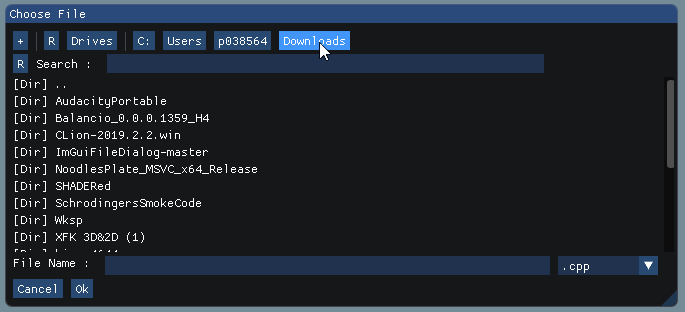
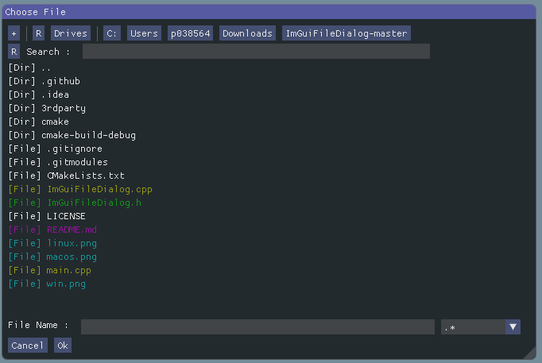

# ImGuiFileDialog

An example of the File Dialog integrated within the ImGui Demo App

- Separate system for call and display
- Can use custom pane via function binding
  - this pane can block the validation of the dialog
  - can also display different things according to current filter and User Datas
- Support of Filter Coloring
- Multi Selection (ctrl/shift + click) :
  - 0 => infinite
  - 1 => one file (default)
  - n => n files
- Compatible with MacOs, Linux, Win
  - On Win version you can list Drives
- Support of Modal/Standard dialog type

## Simple Dialog :
```cpp
void drawGui()
{ 
  // open Dialog Simple
  if (ImGui::Button("Open File Dialog"))
    ImGuiFileDialog::Instance()->OpenDialog("ChooseFileDlgKey", "Choose File", ".cpp\0.h\0.hpp\0\0", ".");

  // display
  if (ImGuiFileDialog::Instance()->FileDialog("ChooseFileDlgKey")) 
  {
    // action if OK
    if (ImGuiFileDialog::Instance()->IsOk == true)
    {
      std::string filePathName = ImGuiFileDialog::Instance()->GetFilepathName();
      std::string filePath = ImGuiFileDialog::Instance()->GetCurrentPath();
      // action
    }
    // close
    ImGuiFileDialog::Instance()->CloseDialog("ChooseFileDlgKey");
  }
}
```


## Dialog with Custom Pane :
```cpp
static bool canValidateDialog = false;
inline void InfosPane(std::string vFilter, UserDatas vUserDatas, bool *vCantContinue) // if vCantContinue is false, the user cant validate the dialog
{
	ImGui::TextColored(ImVec4(0, 1, 1, 1), "Infos Pane");
	ImGui::Text("Selected Filter : %s", vFilter.c_str());
	ImGui::Checkbox("if not checked you cant validate the dialog", &canValidateDialog);
	if (vCantContinue)
	    *vCantContinue = canValidateDialog;
}

void drawGui()
{
  // open Dialog with Pane
  if (ImGui::Button("Open File Dialog with a custom pane"))
    ImGuiFileDialog::Instance()->OpenDialog("ChooseFileDlgKey", "Choose File", ".cpp\0.h\0.hpp\0\0",
            ".", "", std::bind(&InfosPane, std::placeholders::_1, std::placeholders::_2, std::placeholders::_3), 350, 1, "InfosPane");

  // display and action if ok
  if (ImGuiFileDialog::Instance()->FileDialog("ChooseFileDlgKey")) 
  {
    if (ImGuiFileDialog::Instance()->IsOk == true)
    {
		std::string filePathName = ImGuiFileDialog::Instance()->GetFilepathName();
		std::string filePath = ImGuiFileDialog::Instance()->GetCurrentPath();
		std::string filter = ImGuiFileDialog::Instance()->GetCurrentFilter();
		// here convert from string because a string was passed as a userDatas, but it can be what you want
		auto userDatas = std::string((const char*)ImGuiFileDialog::Instance()->GetUserDatas()); 
		auto selection = ImGuiFileDialog::Instance()->GetSelection(); // multiselection

		// action
    }
    // close
    ImGuiFileDialog::Instance()->CloseDialog("ChooseFileDlgKey");
  }
}
```


## Filter Coloring

```cpp
ImGuiFileDialog::Instance()->SetFilterColor(".cpp", ImVec4(1,1,0,0.5));
ImGuiFileDialog::Instance()->SetFilterColor(".h",   ImVec4(0,1,0,0.5));
ImGuiFileDialog::Instance()->SetFilterColor(".hpp", ImVec4(0,0,1,0.5));
ImGuiFileDialog::Instance()->SetFilterColor(".md",  ImVec4(1,0,1,0.5));
ImGuiFileDialog::Instance()->SetFilterColor(".png", ImVec4(0,1,1,0.5));
```



## Multi Selection

You can define in OpenDialog call the count file you wan to select :
- 0 => inifnite
- 1 => one file only (default)
- n => n files only

See the define at the end of these funcs after path.

```cpp
ImGuiFileDialog::Instance()->OpenDialog("ChooseFileDlgKey", "Choose File", ".*\0.cpp\0.h\0.hpp\0\0", ".");
ImGuiFileDialog::Instance()->OpenDialog("ChooseFileDlgKey", "Choose 1 File", ".*\0.cpp\0.h\0.hpp\0\0", ".", 1);
ImGuiFileDialog::Instance()->OpenDialog("ChooseFileDlgKey", "Choose 5 File", ".*\0.cpp\0.h\0.hpp\0\0", ".", 5);
ImGuiFileDialog::Instance()->OpenDialog("ChooseFileDlgKey", "Choose many File", ".*\0.cpp\0.h\0.hpp\0\0", ".", 0);
ImGuiFileDialog::Instance()->OpenDialog("ChooseFileDlgKey", "Choose File", ".png\0.jpg\0\0",
   ".", "", std::bind(&InfosPane, std::placeholders::_1, std::placeholders::_2, std::placeholders::_3), 350, 1, "SaveFile"); // 1 file
```


## Compilation Ok for Win / Linux / MacOs

Win Version :


Linux Version :


MacOs Version :

