[](https://github.com/aiekick/ImGuiFileDialog/actions?query=workflow%3AWin) [](https://github.com/aiekick/ImGuiFileDialog/actions?query=workflow%3ALinux)

# ImGuiFileDialog

An example of the File Dialog integrated within the ImGui Demo App

- Separate system for call and display
- Can use custom pane via function binding
  - this pane can block the validation of the dialog
  - can also display different things according to current filter and User Datas
- Support of Filter Custom Coloring / Icons / text 
- Multi Selection (ctrl/shift + click) :
  - 0 => infinite
  - 1 => one file (default)
  - n => n files
- Compatible with MacOs, Linux, Win
  - On Win version you can list Drives
- Support of Modal/Standard dialog type
- Support both Mode : File Chooser or Directory Chooser
- Support filter collection / Custom filter name
- Support files Exploring with keys : Up / Down / Enter (open dir) / Backspace (come back)
- Support files Exploring by input char (case insensitive)
- Support bookmark creation/edition/call for directory (can have custom name corresponding to a path)
- Support input path edition by right click on a path button

Use the Namespace igfd (for avoid conflict with variables, struct and class names)

## Simple Dialog :
```cpp
void drawGui()
{ 
  // open Dialog Simple
  if (ImGui::Button("Open File Dialog"))
    igfd::ImGuiFileDialog::Instance()->OpenDialog("ChooseFileDlgKey", "Choose File", ".cpp,.h,.hpp", ".");

  // display
  if (igfd::ImGuiFileDialog::Instance()->FileDialog("ChooseFileDlgKey")) 
  {
    // action if OK
    if (igfd::ImGuiFileDialog::Instance()->IsOk == true)
    {
      std::string filePathName = igfd::ImGuiFileDialog::Instance()->GetFilePathName();
      std::string filePath = igfd::ImGuiFileDialog::Instance()->GetCurrentPath();
      // action
    }
    // close
    igfd::ImGuiFileDialog::Instance()->CloseDialog("ChooseFileDlgKey");
  }
}
```


## Directory Chooser :

For have only a directory chooser, you just need to specify a filter null :
```cpp
igfd::ImGuiFileDialog::Instance()->OpenDialog("ChooseDirDlgKey", "Choose a Directory", 0, ".");
```

In this mode you can select any directory with one click, and open directory with double click

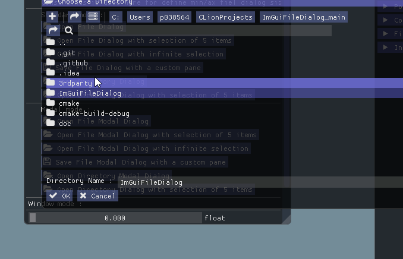

## Dialog with Custom Pane :
```cpp
static bool canValidateDialog = false;
inline void InfosPane(std::string vFilter, igfd::UserDatas vUserDatas, bool *vCantContinue) // if vCantContinue is false, the user cant validate the dialog
{
	ImGui::TextColored(ImVec4(0, 1, 1, 1), "Infos Pane");
	ImGui::Text("Selected Filter : %s", vFilter.c_str());
	if (vUserDatas)
		ImGui::Text("UserDatas : %s", vUserDatas);
	ImGui::Checkbox("if not checked you cant validate the dialog", &canValidateDialog);
	if (vCantContinue)
	    *vCantContinue = canValidateDialog;
}

void drawGui()
{
  // open Dialog with Pane
  if (ImGui::Button("Open File Dialog with a custom pane"))
    igfd::ImGuiFileDialog::Instance()->OpenDialog("ChooseFileDlgKey", "Choose File", ".cpp,.h,.hpp",
            ".", "", std::bind(&InfosPane, std::placeholders::_1, std::placeholders::_2, std::placeholders::_3), 350, 1, igfd::UserDatas("InfosPane"));

  // display and action if ok
  if (igfd::ImGuiFileDialog::Instance()->FileDialog("ChooseFileDlgKey")) 
  {
    if (igfd::ImGuiFileDialog::Instance()->IsOk == true)
    {
		std::string filePathName = igfd::ImGuiFileDialog::Instance()->GetFilePathName();
		std::string filePath = igfd::ImGuiFileDialog::Instance()->GetCurrentPath();
		std::string filter = igfd::ImGuiFileDialog::Instance()->GetCurrentFilter();
		// here convert from string because a string was passed as a userDatas, but it can be what you want
		std::string userDatas;
		if (igfd::ImGuiFileDialog::Instance()->GetUserDatas())
			userDatas = std::string((const char*)igfd::ImGuiFileDialog::Instance()->GetUserDatas()); 
		auto selection = igfd::ImGuiFileDialog::Instance()->GetSelection(); // multiselection

		// action
    }
    // close
    igfd::ImGuiFileDialog::Instance()->CloseDialog("ChooseFileDlgKey");
  }
}
```
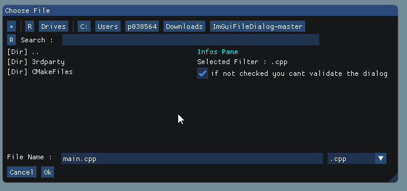

## Filter Infos

You can define color for a filter type
```cpp
igfd::ImGuiFileDialog::Instance()->SetExtentionInfos(".cpp", ImVec4(1,1,0, 0.9));
igfd::ImGuiFileDialog::Instance()->SetExtentionInfos(".h", ImVec4(0,1,0, 0.9));
igfd::ImGuiFileDialog::Instance()->SetExtentionInfos(".hpp", ImVec4(0,0,1, 0.9));
igfd::ImGuiFileDialog::Instance()->SetExtentionInfos(".md", ImVec4(1,0,1, 0.9));
```

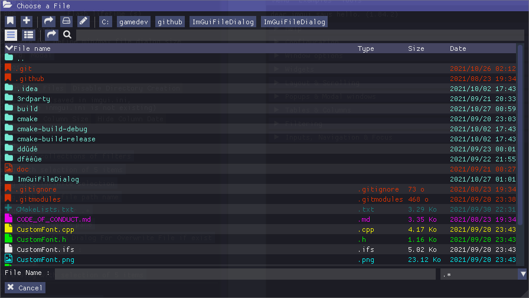

and also specific icons (with icon font files) or file type names :

```cpp
// add an icon for png files 
igfd::ImGuiFileDialog::Instance()->SetExtentionInfos(".png", ImVec4(0,1,1,0.9), ICON_IMFDLG_FILE_TYPE_PIC);
// add a text for gif files (the default value is [File] 
igfd::ImGuiFileDialog::Instance()->SetExtentionInfos(".gif", ImVec4(0, 1, 0.5, 0.9), "[GIF]");
```

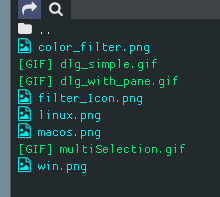

## Filter Collections 

you can define a custom filter name who correspond to a group of filter

you must use this syntax : custom_name1{filter1,filter2,filter3},custom_name2{filter1,filter2},filter1
when you will select custom_name1, the gorup of filter 1 to 3 will be applied
the reserved char are {}, you cant use them for define filter name.

this code :
```cpp
const char *filters = "Source files (*.cpp *.h *.hpp){.cpp,.h,.hpp},Image files (*.png *.gif *.jpg *.jpeg){.png,.gif,.jpg,.jpeg},.md";
igfd::ImGuiFileDialog::Instance()->OpenDialog("ChooseFileDlgKey", ICON_IMFDLG_FOLDER_OPEN " Choose a File", filters, ".");
```
will produce :
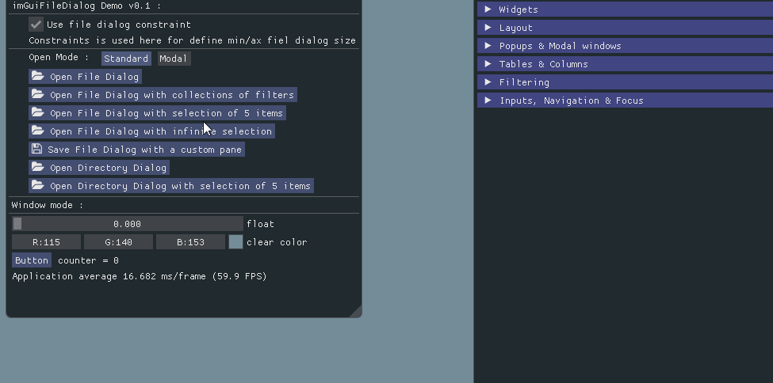

## Multi Selection

You can define in OpenDialog/OpenModal call the count file you wan to select :
- 0 => infinite
- 1 => one file only (default)
- n => n files only

See the define at the end of these funcs after path.

```cpp
igfd::ImGuiFileDialog::Instance()->OpenDialog("ChooseFileDlgKey", "Choose File", ".*,.cpp,.h,.hpp", ".");
igfd::ImGuiFileDialog::Instance()->OpenDialog("ChooseFileDlgKey", "Choose 1 File", ".*,.cpp,.h,.hpp", ".", 1);
igfd::ImGuiFileDialog::Instance()->OpenDialog("ChooseFileDlgKey", "Choose 5 File", ".*,.cpp,.h,.hpp", ".", 5);
igfd::ImGuiFileDialog::Instance()->OpenDialog("ChooseFileDlgKey", "Choose many File", ".*,.cpp,.h,.hpp", ".", 0);
igfd::ImGuiFileDialog::Instance()->OpenDialog("ChooseFileDlgKey", "Choose File", ".png,.jpg",
   ".", "", std::bind(&InfosPane, std::placeholders::_1, std::placeholders::_2, std::placeholders::_3), 350, 1, "SaveFile"); // 1 file
```

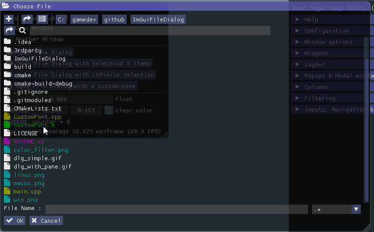

## File Dialog Constraints

you can define min/max size of the dialog when you display It 

by ex : 

* MaxSize is the full display size
* MinSize in the half display size.

```cpp
ImVec2 maxSize = ImVec2((float)display_w, (float)display_h);
ImVec2 minSize = maxSize * 0.5f;
igfd::ImGuiFileDialog::Instance()->FileDialog("ChooseFileDlgKey", ImGuiWindowFlags_NoCollapse, minSize, maxSize);
```

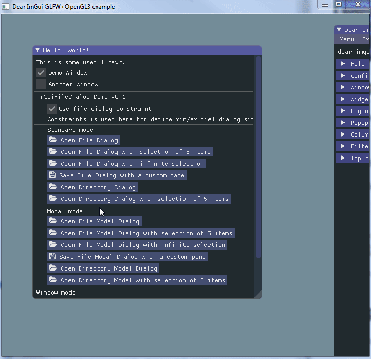

## Detail View Mode

You can have tables display like that.

- you need to use [imgui tables branch](https://github.com/ocornut/imgui/tree/tables) (not merged in master at this moment)
- uncomment "#define USE_IMGUI_TABLES" in you custom config file (CustomImGuiFileDialogConfig.h in this example)

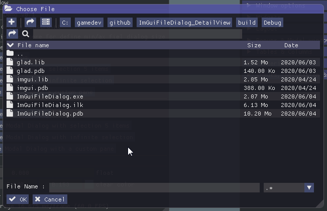

## Exploring by keys

you can activate this feature by uncomment : "#define USE_EXPLORATION_BY_KEYS" 
in you custom config file (CustomImGuiFileDialogConfig.h in this example)

you can also uncomment the next lines for define your keys :

* IGFD_KEY_UP => Up key for explore to the top
* IGFD_KEY_DOWN => Down key for explore to the bottom
* IGFD_KEY_ENTER => Enter key for open directory
* IGFD_KEY_BACKSPACE => BackSpace for comming back to the last directory

you can also explore a file list by use the current key char.

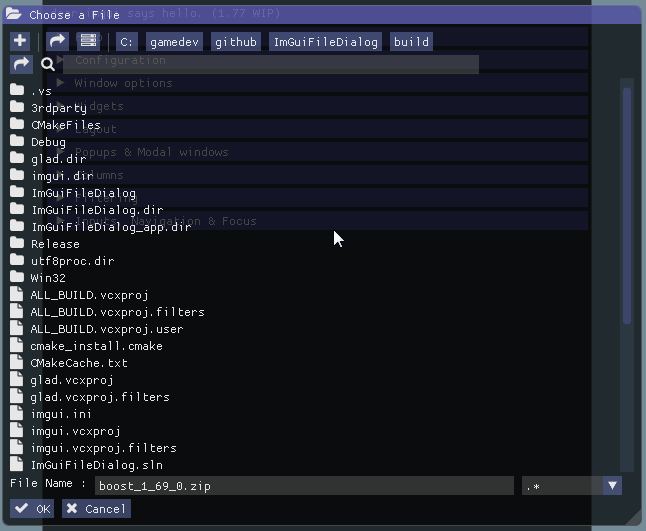

as you see the current item is flashed (by default for 1 sec)
you can define the flashing life time by yourself with the function
```cpp
igfd::ImGuiFileDialog::Instance()->SetFlashingAttenuationInSeconds(1.0f);
```
## Bookmarks

you can create/edit/call path bookmarks and load/save them in file

you can activate it by uncomment : "#define USE_BOOKMARK"

in you custom config file (CustomImGuiFileDialogConfig.h in this example)

you can also uncomment the next lines for customize it :
```cpp
#define bookmarkPaneWith 150.0f => width of the bookmark pane
#define IMGUI_TOGGLE_BUTTON ToggleButton => customize the Toggled button (button stamp must be : (const char* label, bool *toggle)
#define bookmarksButtonString "Bookmark" => the text in the toggle button
#define bookmarksButtonHelpString "Bookmark" => the helper text when mouse over the button
#define addBookmarkButtonString "+" => the button for add a bookmark
#define removeBookmarkButtonString "-" => the button for remove the selected bookmark
```

* you can select each bookmark for edit the displayed name corresponding to a path
* you must double click on the label for apply the bookmark 

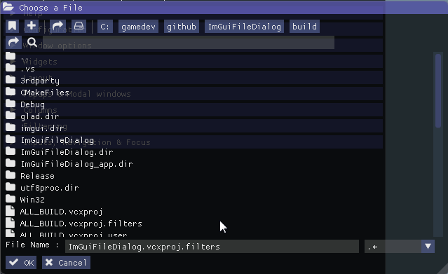

you can also serialize/deserialize bookmarks by ex for load/save from/to file : (check the app sample by ex)
```cpp
Load => igfd::ImGuiFileDialog::Instance()->DeserializeBookmarks(bookmarString);
Save => std::string bookmarkString = igfd::ImGuiFileDialog::Instance()->SerializeBookmarks();
```

## Path Edition :

if you click right on one of any path button, you can input or modify the path pointed by this button.
then press the validate key (Enter by default with GLFW) for validate the new path
or press the escape key (Escape by default with GLFW) for quit the input path edition

see in this gif :
1) button edition with mouse button right and escape key for quit the edition
2) focus the input and press validation for set path

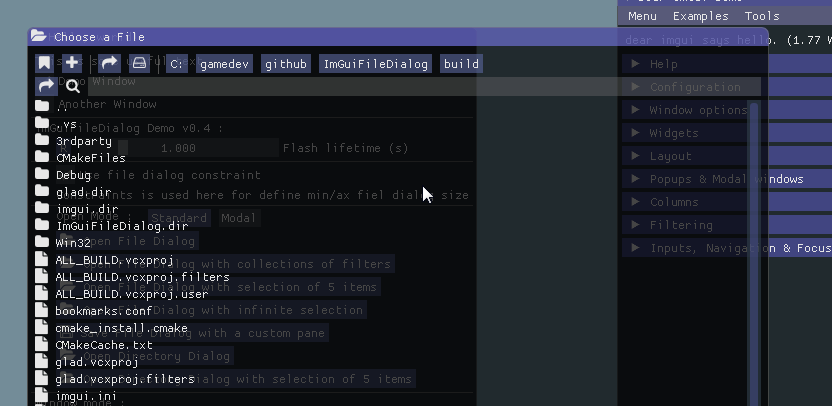

## How to Integrate ImGuiFileDialog in your project

### ImGuiFileDialog require :

* [dirent v1.23](https://github.com/tronkko/dirent/tree/v1.23) lib, only for windows. Successfully tested with version v1.23 only
* [ImGui](https://github.com/ocornut/imgui/tree/master) (with/without tables widgets)

### Customize ImGuiFileDialog :

You just need to write your own config file by override the file : ImGuiFileDialog/ImGuiFileDialogConfig.h
like i do here with CustomImGuiFileDialogConfig.h

After that, for let ImGuiFileDialog your own custom file,
you must define the preprocessor directive CUSTOM_IMGUIFILEDIALOG_CONFIG with the path of you custom config file.
This path must be relative to the directory where you put ImGuiFileDialog module.

Thats all.

You can check by example in this repo with the file CustomImGuiFileDialogConfig.h :
- this trick was used for have custom icon font instead of labels for buttons or messages titles
- you can also use your custom imgui button, the button call stamp must be same by the way :)

The Custom Icon Font (in [CustomFont.cpp](CustomFont.cpp) and [CustomFont.h](CustomFont.h)) was made with [ImGuiFontStudio](https://github.com/aiekick/ImGuiFontStudio) i wrote for that :)
ImGuiFontStudio is using also ImGuiFileDialog.

